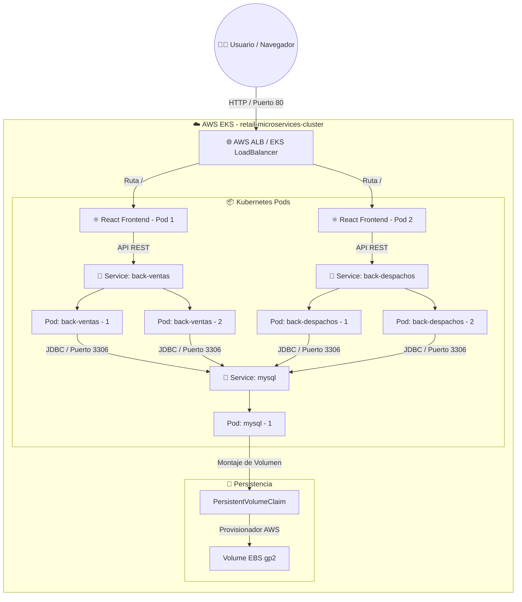

# 🏢 Innovatech Retail - DevOps, Terraform & AWS EKS Architecture


## 📖 Descripción del Proyecto

Este repositorio contiene la arquitectura de microservicios, la infraestructura como código (IaC) y el pipeline de entrega continua (CI/CD) para **Innovatech Retail** (gestión de ventas y despachos). 

El proyecto fue migrado desde una infraestructura tradicional basada en máquinas virtuales EC2 independientes hacia un clúster elástico administrado de **AWS EKS (Elastic Kubernetes Service)**. Esta evolución garantiza alta disponibilidad, tolerancia a fallos, persistencia robusta de datos y escalabilidad automática basada en la demanda de tráfico de CPU.

---

## 🏗️ Arquitectura de la Solución (EKS)

El sistema de **Innovatech Retail** se ejecuta en un clúster EKS estructurado de forma redundante y distribuido en múltiples zonas de disponibilidad dentro de una VPC de AWS:



### Componentes Clave de la Infraestructura:
1. **AWS VPC (`network.tf`, `security_groups.tf`):** Red virtual dividida en subredes públicas y privadas distribuidas en zonas de disponibilidad redundantes. Las reglas de firewall virtuales restringen el acceso para permitir que solo el balanceador de carga web exponga servicios al exterior.
2. **EKS Cluster & Node Group (`eks.tf`):** Un plano de control administrado de Kubernetes que escala y gestiona nodos de cómputo basados en instancias EC2 `t3.medium`.
3. **Automatización EBS CSI Driver:** Un complemento integrado directo de Terraform que interactúa con la API de AWS para aprovisionar volúmenes EBS persistentes bajo demanda.
4. **Horizontal Pod Autoscalers (HPA):** Autoescaladores basados en el uso de recursos de CPU que expanden dinámicamente las réplicas de los contenedores cuando la carga supera el 50% de uso.

---

## ⚙️ Tecnologías y Lenguajes
* **Frontend:** React JS, Nginx (Puerto 8080)
* **Backend Ventas:** Java 17, Spring Boot (Puerto 8082)
* **Backend Despachos:** Java 17, Spring Boot (Puerto 8081)
* **Base de Datos:** MySQL 8.0 (Puerto 3306)
* **IaC & Orquestación:** Terraform, Kubernetes v1.30+
* **Contenedores y Registro:** Docker, Amazon ECR (Elastic Container Registry)

---

## 🚀 Guía de Despliegue en AWS (Paso a Paso)

Sigue estas fases secuenciales para levantar toda la infraestructura y desplegar la aplicación automáticamente.

### Fase 1: Configurar Credenciales de AWS
1. Inicia tu laboratorio de **AWS Academy (Learner Lab)**.
2. Haz clic en **AWS Details** y copia el bloque de texto de **AWS CLI Credentials**.
3. En tu terminal local, ejecuta `aws configure` e introduce los valores o exporta directamente las variables temporales:
   ```bash
   aws configure
   ```

### Fase 2: Levantar el Clúster de EKS con Terraform
1. Dirígete a la carpeta de infraestructura:
   ```bash
   cd infra/terraform
   ```
2. Inicializa Terraform y descarga los proveedores de AWS:
   ```bash
   terraform init
   ```
3. Crea el clúster de Kubernetes, la VPC y los repositorios ECR (el proceso tarda de **10 a 15 minutos**):
   ```bash
   terraform apply -auto-approve
   ```

### Fase 3: Configurar Secretos en tu Repositorio de GitHub
Para permitir que el pipeline de GitHub Actions despliegue las imágenes de contenedores en tu clúster de producción, agrega las siguientes credenciales actualizadas de tu laboratorio:

En GitHub, ve a **Settings** -> **Secrets and variables** -> **Actions**:
* **Repository Secrets:**
  * `AWS_ACCESS_KEY_ID`
  * `AWS_SECRET_ACCESS_KEY`
  * `AWS_SESSION_TOKEN`
* **Repository Variables (en la pestaña de Variables):**
  * `AWS_REGION` = `us-east-1`
  * `CLUSTER_NAME` = `retail-microservices-cluster`
  * `DB_USER` = `retail_user`
  * `DB_URL` = `jdbc:mysql://mysql:3306/retail_db`

### Fase 4: Ejecutar el Pipeline de Despliegue (CI/CD)
El despliegue es completamente automatizado por el workflow en `.github/workflows/cd-deployment.yml`. 
1. Realiza un push o un merge de tus cambios a la rama **`deploy`** de tu repositorio.
2. GitHub Actions compilará los proyectos Java y React, construirá imágenes Docker de arquitectura `linux/amd64`, las subirá a AWS ECR y desplegará todos los manifiestos en tu clúster de EKS realizando una actualización progresiva (*rolling update*).

---

## 🔍 Monitorear y Verificar en Kubernetes

Una vez que el pipeline finalice con éxito, puedes interactuar directamente con tu clúster desde la terminal de tu computadora:

1. **Vincular tu consola local con el clúster de EKS:**
   ```bash
   aws eks update-kubeconfig --region us-east-1 --name retail-microservices-cluster
   ```
2. **Visualizar el estado de los componentes (Pods, Services, Deployments):**
   ```bash
   kubectl get all
   ```
3. **Verificar el autoescalado de las aplicaciones:**
   ```bash
   kubectl get hpa
   ```
4. **Obtener la URL pública del Frontend:**
   ```bash
   kubectl get service front-despacho
   ```
   Busca la dirección de la columna **`EXTERNAL-IP`** (será una URL larga de AWS Load Balancer). Cópiala y pégala en tu navegador para interactuar con la aplicación.

---

## 🗑️ Guía de Limpieza y Destrucción

Para evitar cobros extras en AWS o conflictos de recursos huérfanos al volver a levantar el laboratorio:

1. **Borrar los recursos de Kubernetes primero (para liberar balanceadores y discos):**
   *(Ejecutar en la carpeta `infra/k8s`)*
   ```bash
   kubectl delete -f .
   ```
2. **Destruir la red e infraestructura con Terraform:**
   *(Ejecutar en la carpeta `infra/terraform`)*
   ```bash
   terraform destroy -auto-approve
   ```
